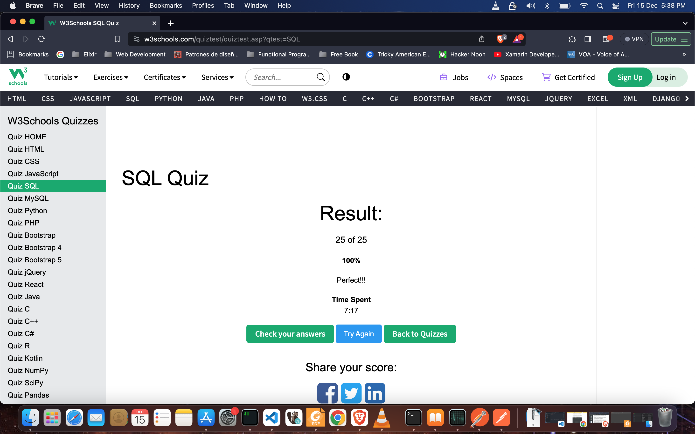

# QA Automation Answers

# Setup Instructions

### Prerequisites

1. Install Python3.10
2. Install pyenv(https://github.com/pyenv/pyenv#installation)
3. Install Postman(https://www.postman.com/)
4. Install jmeter(https://jmeter.apache.org/)

### Locally

The following instructions and commands need to be executed in your computer.

1. In your terminal install python 3.10 with pyenv
   - Run: `pyenv install <python version>`
2. In your terminal where you want to create a new virtual environment.
   - Run: `pyenv virtualenv <name of venv>`
3. In your terminal activate your virtual environment
   - Run: `pyenv activate <name of venv>`
4. `cd` to where you want to clone this repository
   - Run: `git clone <repo>`

## How to run the tests.

## Part 1

###Selenium

1. Install Selenium -> `pip install selenium`

####Scenario 1

1. cd part_1/selenium
2. python `Scenario1.py`
3. Check test result in the terminal.

####Scenario 2

1. cd part_1/selenium
2. python `Scenario2.py``
3. Check test result in the terminal.

###Postman

1. Open postman app
2. import the file `part_1/postman/Scenario_3_4.postman_collection.json``
3. Run the request for scenario 3 (`Login`) and scenario 4 (`Upload File`)

###Jmeter

1. Open a terminal and run the command `jmeter`` to start the jmeter app
2. Open de test plan file `part_1/jmeter/HTTP Request.jmx`
3. click Play button  for scenario 3 (`Login`) and scenario 4 (`Upload File`)

## Part 2

1)•Explain the difference, in databases, between ‘Having’ and ‘where’ when it comes to a query. Develop one example for each one of this two cases and point out the difference.

    Differences:
    WHERE se utiliza para filtrar filas individuales antes de agrupar resultados.
    HAVING se utiliza para filtrar grupos de resultados basados en condiciones de agregación.

2)Write a query for create a data table ‘Student’ with the following attributes in it: ‘Name, ‘Code, ‘Class’, ‘Age’, ‘Favorite Subject, ‘GPA’ (5.0 scale).

    CREATE TABLE Student (
        Name VARCHAR(50),
        Code VARCHAR(10),
        Class VARCHAR(50),
        Age INT,
        Favorite_Subject VARCHAR(50),
        GPA DECIMAL(3, 2)
    );

3) Insert at least 40 records in the last table with close to real data.

    `INSERT INTO Student (Name, Code, Class, Age, Favorite_Subject, GPA) VALUES
        ('María Pérez', 'A001', 'Historia del Arte', 20, 'Renacimiento', 3.9),
        ('Juan González', 'A002', 'Matemáticas', 21, 'Geometría Analítica', 4.1),
        ('Ana Martínez', 'A003', 'Biología Celular', 22, 'Genética', 4.3),
        ('Carlos Rodríguez', 'A004', 'Literatura Universal', 20, 'Teatro Griego', 3.8),
        ('Sofía García', 'A005', 'Física Moderna', 23, 'Mecánica Cuántica', 4.5),
        ('Daniel Sánchez', 'A006', 'Economía', 21, 'Microeconomía', 3.7),
        ('Laura López', 'A007', 'Química Inorgánica', 22, 'Química Analítica', 4.2),
        ('Javier Martín', 'A008', 'Psicología', 20, 'Psicología Cognitiva', 3.9),
        ('Paula Ramírez', 'A009', 'Derecho Internacional', 24, 'Derecho Penal', 4.0),
        ('Miguel Fernández', 'A010', 'Ingeniería de Software', 23, 'Desarrollo Web', 4.4),
        ('Elena Gómez', 'A011', 'Biología Marina', 21, 'Ecología Acuática', 4.1),
        ('Alejandro Pérez', 'A012', 'Antropología', 22, 'Antropología Forense', 3.8),
        ('Carmen Torres', 'A013', 'Arquitectura', 20, 'Diseño Urbano', 4.3),
        ('Pedro Ruiz', 'A014', 'Sociología', 24, 'Movimientos Sociales', 3.6),
        ('Isabella González', 'A015', 'Arte Contemporáneo', 22, 'Instalaciones Artísticas', 4.6),
        ('Diego Martínez', 'A016', 'Estadística', 21, 'Análisis de Datos', 3.9),
        ('Valentina Sánchez', 'A017', 'Neurociencia', 23, 'Neurobiología Molecular', 4.1),
        ('Emilio Gómez', 'A018', 'Filosofía', 20, 'Ética', 4.0),
        ('Luisa Ramírez', 'A019', 'Derecho Civil', 24, 'Contratos', 4.4),
        ('Andrés Fernández', 'A020', 'Ingeniería Eléctrica', 21, 'Electrónica de Potencia', 4.2),
        ('Camila López', 'A021', 'Medicina', 22, 'Anatomía Humana', 4.5),
        ('Gustavo Martín', 'A022', 'Historia', 20, 'Edad Media', 3.8),
        ('Lucía Pérez', 'A023', 'Geología', 23, 'Geología Estructural', 4.3),
        ('Felipe Rodríguez', 'A024', 'Literatura Comparada', 21, 'Novela del Siglo XX', 4.1),
        ('Victoria García', 'A025', 'Física Nuclear', 22, 'Física de Partículas', 3.9),
        ('Renata Sánchez', 'A026', 'Economía Internacional', 20, 'Comercio Internacional', 4.2),
        ('Marcos Ramírez', 'A027', 'Química Orgánica', 24, 'Síntesis Orgánica', 4.4),
        ('Carolina Fernández', 'A028', 'Psicología Social', 21, 'Psicología Organizacional', 3.7),
        ('Roberto Gómez', 'A029', 'Derecho Penal', 22, 'Criminología', 4.3),
        ('Lucas Pérez', 'A030', 'Marketing', 20, 'Estrategias de Mercado', 4.0),
        ('Julia Martínez', 'A031', 'Biología Molecular', 23, 'Genómica', 4.6),
        ('Ignacio González', 'A032', 'Antropología Cultural', 21, 'Evolución Humana', 3.8),
        ('Alicia Ramírez', 'A033', 'Arquitectura Sostenible', 24, 'Diseño Ecológico', 4.2),
        ('Hugo Fernández', 'A034', 'Sociología Urbana', 22, 'Planificación Urbana', 3.9),
        ('Marina López', 'A035', 'Arte Moderno', 21, 'Expresionismo Abstracto', 4.5),
        ('Bruno Martín', 'A036', 'Estadística Avanzada', 23, 'Análisis Multivariado', 4.0),
        ('Valeria Pérez', 'A037', 'Neurociencia Cognitiva', 20, 'Memoria y Cognición', 4.4),
        ('Martín González', 'A038', 'Filosofía Política', 21, 'Teoría de la Justicia', 4.3),
        ('Ana García', 'A039', 'Derecho Internacional', 23, 'Derechos Humanos', 3.7),
        ('Diego Ramírez', 'A040', 'Ingeniería Biomédica', 22, 'Bioinstrumentación', 4.1);

4)Write a query to get the average of the GPA from all the students which name starts with ‘A’.

    SELECT AVG(GPA) AS Promedio_GPA
    FROM Student
    WHERE Name LIKE 'A%';

5)Write a query to get the list of students that are in the same class, have a GPA higher than 3.5/5.0 and order them by Age and Name. 

    SELECT *
    FROM Student
    WHERE Class = 'Name_of_the_class'
    AND GPA > 3.5
    ORDER BY Age, Name;

6)Write a query to get the list of all the students with ‘Name, ‘Code, ‘Class’, ‘Age’, ‘Favorite Subject, ‘GPA’.

    SELECT Name, Code, Class, Age, Favorite_Subject, GPA
    FROM Student;

7)	Take the following 25 question quiz about SQL, please include a screenshot about the results and time it took to take the test.
http://www.w3schools.com/quiztest/quiztest.asp?qtest=SQL

## Part 3

1) What is the difference between a unit test, an acceptance test, an integration test and an end-to-end test?

    Cada tipo de prueba tiene su propósito específico en el ciclo de vida del desarrollo de software y se enfoca en diferentes aspectos y niveles del sistema.
    para poder responder la pregunta primero hablemos sobre las cualidades de cada una y de ultimo sus diferencias

        Las pruebas unitarias : 
            se centran en validar el comportamiento individual de componentes o unidades de código.
            Son pruebas pequeñas y se ejecutan de manera aislada, generalmente escritas por los desarrolladores.
            Su objetivo es asegurar que cada parte del código (una función, método o clase) funcione correctamente según su diseño.
            Se realizan usando frameworks de pruebas como JUnit, NUnit, Jest, entre otros, y se ejecutan frecuentemente durante el desarrollo.

        Las pruebas de integración :
            evalúan cómo los componentes individuales se combinan y funcionan juntos como un sistema más grande.
            Verifican la interacción entre diferentes partes del sistema y cómo se integran para formar un conjunto funcional.
            Pueden ser manuales o automatizadas y se realizan después de las pruebas unitarias para asegurar que las unidades funcionen en conjunto correctamente.
            Identifican problemas que pueden surgir debido a la interacción entre módulos y cómo se comunican entre sí.
       
        Las pruebas de aceptación :
            validan si el sistema cumple con los requisitos y expectativas del cliente o usuario final.
            Generalmente se realizan para evaluar el comportamiento del sistema desde la perspectiva del usuario final.
            Pueden ser automatizadas o manuales, y a menudo se basan en escenarios de uso del sistema.
            Están diseñadas para asegurar que el software entregado cumpla con las necesidades y expectativas del cliente.
            
        Las pruebas de extremo a extremo:
            evalúan todo el flujo de un sistema desde el inicio hasta el final.
            Verifican el funcionamiento del sistema completo, incluyendo la interacción de todos los componentes y su comportamiento en un entorno similar al de producción.
            A menudo simulan el flujo real del usuario, desde la entrada de datos hasta la salida y las interacciones entre varios sistemas o módulos.
            Pueden ser complejas y requieren escenarios de prueba bien diseñados para cubrir todas las funcionalidades.
        
    En resumen
    las pruebas unitarias se centran en partes individuales del código.
    las pruebas de integración se centran en cómo se combinan estas partes
    las pruebas de aceptación se enfocan en validar los requisitos del usuario
    mientras que las pruebas de extremo a extremo evalúan el sistema completo en un entorno similar al de producción
    Todas estas pruebas son importantes para garantizar la calidad y el funcionamiento correcto del software.

2) Could you explain Cohn's automation pyramid?

    La idea central de la pirámide es que las pruebas más básicas y rápidas (pruebas unitarias) conformen la base sólida de las pruebas automatizadas
    mientras que las pruebas de integración, las pruebas de UI y las pruebas de sistema sean menos numerosas pero complementen y validen la funcionalidad del sistema desde diferentes perspectivas.
    Este modelo proporciona una guía sobre la distribución adecuada de esfuerzos y recursos en las pruebas automatizadas
    destacando la importancia de las pruebas unitarias y fomentando un equilibrio entre los diferentes niveles de pruebas para mejorar la calidad del software.

3)  Could you explain the difference between a black box testing and a white box testing?

    La principal diferencia entre pruebas de caja negra y pruebas de caja blanca radica en el nivel de conocimiento que tiene el tester sobre el sistema o software a probar.
    En las pruebas de caja negra, se prueba la funcionalidad sin considerar la lógica interna
    mientras que en las pruebas de caja blanca se evalúa la estructura y la lógica interna del código.
    Ambas técnicas son complementarias y se utilizan en conjunto para garantizar una cobertura exhaustiva en la validación del software.

4) What is the purpose of an exploratory test and when is it useful to run them?

    Una prueba exploratoria es una técnica de prueba en la que el tester, en lugar de seguir un plan de pruebas detallado y predefinido, interactúa dinámicamente con el software, investigando, descubriendo y evaluando su funcionamiento de manera espontánea y creativa.
    El propósito principal de las pruebas exploratorias es descubrir defectos y problemas no documentados o inesperados en el software, así como comprender mejor su funcionamiento en un tiempo limitado.

    Las pruebas exploratorias son útiles en varias situaciones.
    como al inicio del ciclo de desarrollo cuando hay poca documentación disponible
    en situaciones de tiempo limitado para pruebas formales.
    en áreas críticas donde se necesitan pruebas adicionales, o simplemente para explorar y comprender mejor el software.
    Además, pueden ser una herramienta valiosa en equipos ágiles o métodos de desarrollo iterativos, donde se valora la adaptabilidad y la flexibilidad en el proceso de prueba.

5) Mention at least 5 test design techniques and explain them briefly

    A)Pruebas de Equivalencia:

        Explicación: Esta técnica consiste en dividir el conjunto de datos en clases de equivalencia y luego seleccionar casos de prueba representativos de cada clase.
        
        Uso: Se eligen un conjunto mínimo de casos de prueba que cubran diferentes escenarios dentro de cada clase de equivalencia. Por ejemplo, si una función espera números entre 1 y 100, se seleccionarán casos de prueba para valores dentro, en el límite y fuera de ese rango.
    
    B)Pruebas de Límites (Boundary Testing):

        Explicación: Se enfoca en probar los límites o bordes entre diferentes clases de equivalencia.

        Uso: Se seleccionan casos de prueba que se encuentren en los límites, incluyendo valores límite y justo fuera de estos límites. Por ejemplo, si se tiene un campo de entrada que acepta valores entre 1 y 10, las pruebas de límites se centran en probar con 1, 10 y valores como 0 y 11.

    C)Tabla de Decisión (Decision Table Testing):

        Explicación: Se utiliza para probar combinaciones específicas de condiciones de entrada y determinar las acciones correspondientes.
        
        Uso: Se crea una tabla que enumera todas las posibles combinaciones de condiciones de entrada y sus acciones asociadas. Luego, se prueban cada una de estas combinaciones.

    D)Pruebas de Estado (State Transition Testing):

        Explicación: Esta técnica se utiliza para probar el comportamiento de un sistema en diferentes estados y las transiciones entre estos estados.
        
        Uso: Se modelan los diferentes estados del sistema, junto con las transiciones permitidas entre ellos. Las pruebas se centran en probar estas transiciones y el comportamiento del sistema en cada estado.

    E)Pruebas Basadas en Caja Negra (Black Box Testing):

        Explicación: Se enfoca en probar la funcionalidad del software sin conocer su estructura interna o lógica de implementación.
        
        Uso: Los casos de prueba se diseñan basándose en especificaciones, requisitos, y la funcionalidad esperada del software. Se prueban las entradas y salidas del sistema sin considerar el código interno.

6)	What is the purpose of the following types of tests?
	•	Functional test: 
	•	Performance test: 
	•	Security test:
	•	Usability test: 
	•	API test: 
	•	Unit Test:

    • Prueba funcional:

            Propósito: Verificar que el software cumpla con los requisitos funcionales especificados.
            
            Enfoque: Evaluar las funciones, características y comportamientos del software desde la perspectiva del usuario final.

    • Prueba de rendimiento:

            Propósito: Evaluar cómo se comporta el software en términos de velocidad, capacidad, escalabilidad y estabilidad bajo diferentes cargas y situaciones.

            Enfoque: Medir y analizar el rendimiento del software en términos de tiempo de respuesta, uso de recursos, tiempo de procesamiento, etc.
    
    • Prueba de seguridad:

            Propósito: Identificar vulnerabilidades, riesgos y problemas de seguridad en el software para protegerlo contra posibles amenazas.
            
            Enfoque: Evaluar la resistencia del sistema ante ataques, fallos de seguridad, robo de datos, entre otros.  

    • Prueba de usabilidad:

            Propósito: Evaluar la facilidad de uso, la eficiencia y la satisfacción del usuario al interactuar con el software.
            
            Enfoque: Analizar la interfaz de usuario, la navegación, la accesibilidad y la experiencia general del usuario.

    • Prueba API:

            Propósito: Verificar el comportamiento funcional, la confiabilidad y la integración entre diferentes componentes del software a través de sus interfaces.
            
            Enfoque: Probar los métodos de entrada/salida, el manejo de errores, la autenticación, la seguridad y la interoperabilidad de las API.

    • Prueba de unidad:

            Propósito: Verificar que las unidades individuales de código (funciones, métodos, clases) funcionen correctamente de manera aislada.
            
            Enfoque: Evaluar la funcionalidad de las partes más pequeñas del software a través de pruebas específicas realizadas por los desarrolladores.

